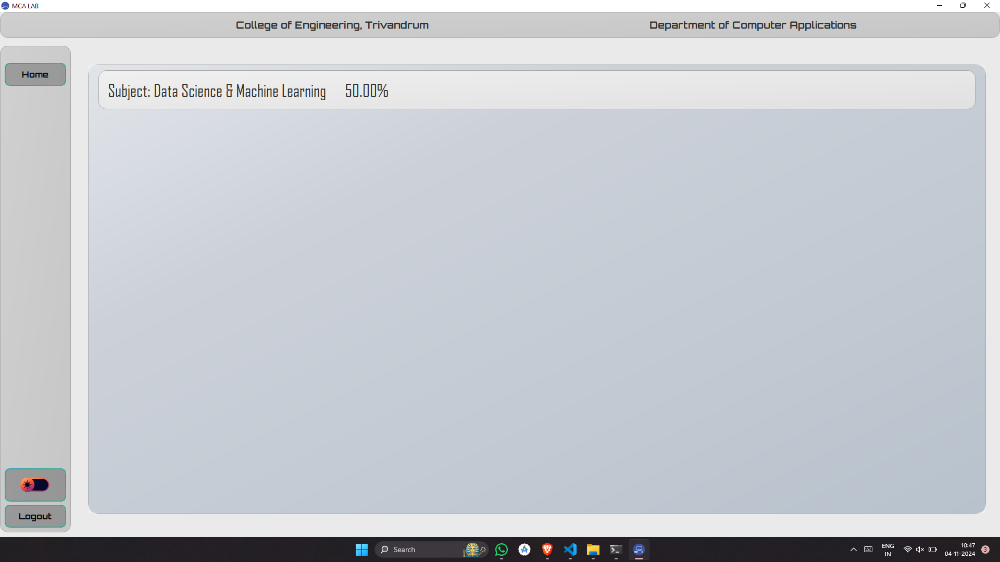

# Department Management and Learning Platform

[Gist Link](https://gist.github.com/vyshnav20/6c5145dba9427bbeb4a1b6292efa337a)

**Description:**  
A management system designed to streamline academic and administrative processes within the MCA department. Features include exam scheduling, lab exams, and real-time result tracking.

**Features:**  
- Schedule and manage exams efficiently.
- Students can attend exams and view results in real-time.
- Lab exam module for practical evaluations.

**Technologies Used:**  
- **Backend:** Python, Firebase Realtime Database
- **Frontend:** PyQt
- **Cross-Platform Deployment:** Briefcase

**Screenshots:**
1. **Login Screen**    
2. **Admin Home Page**   
3. **Schedule Exam**   
4. **Edit Exam**   
5. **Add Questions**   
6. **Update Question**   
7. **Result Page (Admin)**   
8. **Student Home Page**   
9. **Student Profile**   
10. **Code Editor**   
11. **Code Compiler**   
12. **Exam Schedule** .png)  
13. **Subjects**   
14. **Time Table**   
15. **Student Result**   
